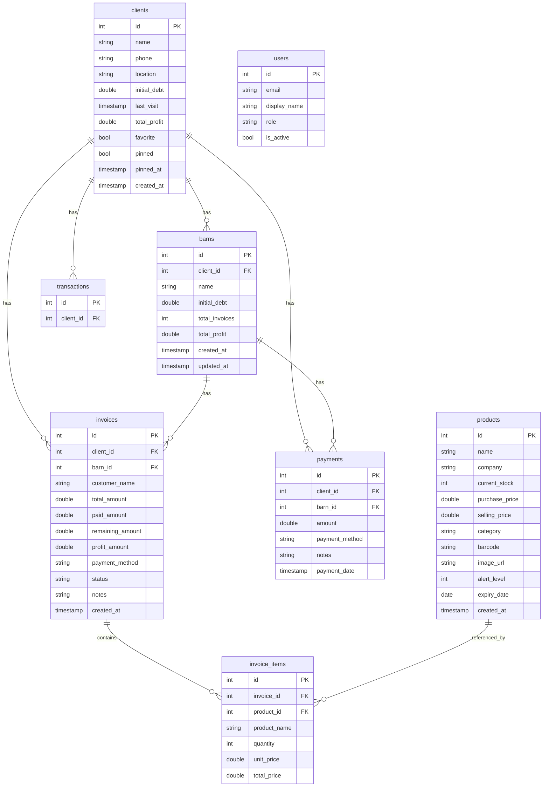
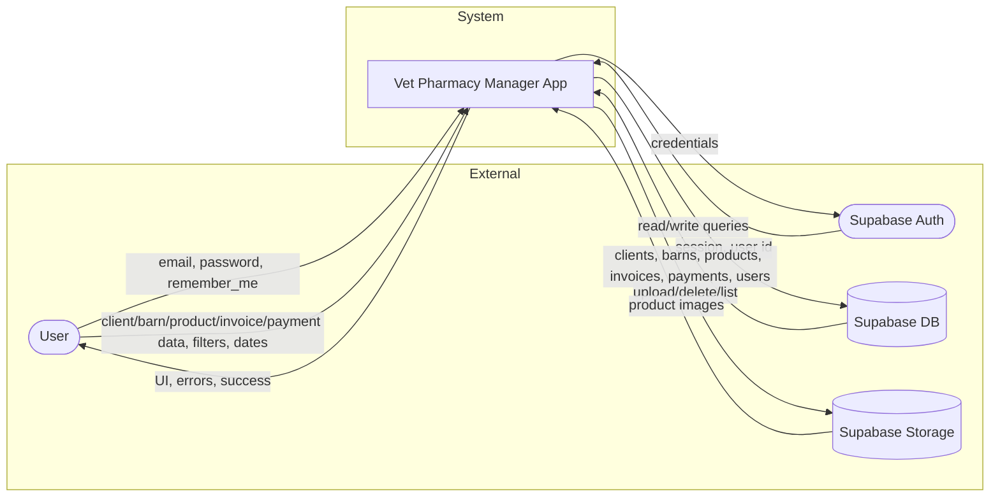
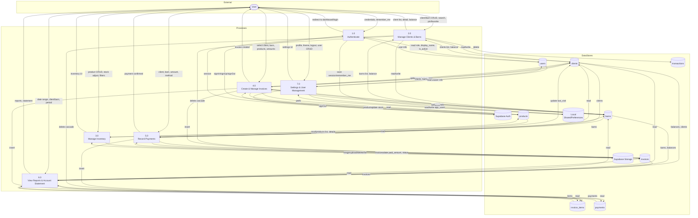

# Vet Pharmacy Manager — Full Description, Entities, Data Flow & Diagrams

This document gives a complete description of the app from login/signup through the most complex flows, lists all entities with attributes, summarizes data flow, and provides an ERD, a context diagram, and a Level 1 data flow diagram.

---

## 1. App Overview

**Vet Pharmacy Manager** is a Flutter (Dart) mobile application for managing a **veterinary pharmacy**. It is **Arabic-first (RTL)** and **portrait-only**. The app handles:

- **Users & auth** (Supabase Auth + app `users` table for roles)
- **Clients** (with optional **barns/chambers** per client)
- **Products** (inventory, stock, categories, images in Supabase Storage)
- **Invoices** (header + line items, cash/credit, paid/remaining)
- **Payments** (per client/barn, allocated to unpaid invoices)
- **Reports** (sales, profit, active clients, top products, by category)
- **Account statement** (by client or by barn, date range, opening/closing balance)

**Tech stack:** Flutter, Supabase (Auth + PostgreSQL + Storage), SharedPreferences (remember-me, legacy app_users).

---

## 2. Flow from Login to Most Complex Features

### 2.1 Startup & Auth

1. **App start** (`main.dart`): Load `env.json` → initialize Supabase (url, anon key) → `StorageSetup.initializeStorage()` (bucket `product-images`) → initial route `/` → **SplashScreen**.
2. **SplashScreen**: Reads `AuthService.currentUser` (Supabase). If user exists **and** “remember me” is set → navigate to **Dashboard**; else → sign out and navigate to **Login**.
3. **Login**: User enters email/password. `AuthService.signInWithEmail()` → Supabase `signInWithPassword`. On success:
   - Fetch row from **users** by email → `display_name`, `role`, `is_active`.
   - If `is_active == false` → sign out and show error.
   - Else → save current user to SharedPreferences (`current_user_*`) and optionally save email for “remember me” → navigate to **Dashboard**.
4. **Sign up**: Handled via Supabase Auth (`signUp`); app also reads **users** for role/display_name after login.
5. **Logout** (Settings): `AuthService.signOut()` → Supabase signOut + clear SharedPreferences (current_user_*, role, username).

**Roles:** `super_admin`, `admin`, `staff`. Permissions (e.g. view_profits, manage_clients, manage_users, view_reports, edit_inventory, delete_invoice) are checked in `AuthService.hasPermission`. User management (create/update/delete users) uses legacy SharedPreferences `app_users` for local users; **login** uses Supabase Auth + **users** table.

---

### 2.2 Dashboard

- **Data:** `SupabaseService.getDashboardStatistics()` (cached 5 min). Fallback: queries to **invoices** (total_amount, paid_amount, status), **products** (stock, alert_level, expiry_date, purchase_price), **invoice_items** (quantity, unit_price, products.purchase_price), **clients** and **barns** (initial_debt), plus recent invoices with clients/barns.
- **Displayed:** Total sales, total profit, total client debt, product count, low-stock count, expiring count, unpaid invoices count, total inventory value, recent invoices list.
- **Actions:** Quick links to Clients, Inventory, New Invoice, Invoice History, Reports; “Account statement” opens client selection → then **AccountStatementScreen**.

---

### 2.3 Clients

- **List:** `SupabaseService.getClientsPaginated()` / `getClientsWithPagination()` from **clients** (search by name/phone, sort: pinned first then name). Background: `getClientTotalBalance(clientId)` for balance display.
- **CRUD:** Add → `addClient`; Edit → `updateClient`; Favorite → `updateClientFavoriteStatus`; Pin → `updateClientPinnedStatus`; Delete → `deleteClientWithAllData` (cascades: invoice_items → invoices → transactions → clients). Cache cleared after writes.
- **Client detail:** Tabs — **Info** (balance, add payment), **History** (payments), **Barns** (list, add/edit/delete barn). Data: `getClientBarns`, `getBarnTotalBalance`, `getClientInvoices`, `getClientTotalBalance`. Writes: `updateClient`, `addBarn`, `updateBarn`, `deleteRow('barns')`; from Info tab: `insertRow('payments')`, `updateRow('invoices', paid_amount/status)`, `updateClient`.

---

### 2.4 Barns (Chambers)

- **Entity:** Belongs to one **client**. Has own `initial_debt`, `total_invoices`, `total_profit`, `updated_at`.
- **Usage:** Selected when creating an invoice or a payment. Invoices and payments are linked to **barn_id** and **client_id**. Account statement can be by client or by barn.

---

### 2.5 Inventory (Products)

- **List:** `SupabaseService.getProductsWithPagination()` from **products** (search, category filter, low-stock/expiring filters). Images from Storage bucket `product-images`.
- **CRUD:** Add/Edit/Delete in **InventoryManagementScreen** via `_supabase.from('products').insert/update/delete`. Stock adjustments update `current_stock`. Product image upload/delete uses Storage `product-images`.

**Product fields used:** id, name, company, current_stock, purchase_price, selling_price, category, barcode, image_url, alert_level, expiry_date, created_at.

---

### 2.6 Invoices

- **Create (InvoiceCreationScreen):**
  - Select client → load barns → select barn (optional) → add products (from **products**) with quantity → set payment method (كاش / آجل), paid amount, notes.
  - On save:
    1. Insert **invoices** (customer_name, client_id, barn_id?, total_amount, paid_amount, remaining_amount, payment_method, status, profit_amount, notes).
    2. Insert **invoice_items** per line (invoice_id, product_id?, product_name, quantity, unit_price, total_price).
    3. Update **products** (`current_stock` -= quantity).
    4. Update **clients** (total_profit, last_visit).
    5. Update **barns** (total_invoices, total_profit, updated_at).
  - Caches: `clearInvoicesCache()`.
- **History:** `getAllInvoicesWithPagination()` (invoices + clients/barns), with **invoice_items** loaded; from here user can open **PaymentCreationScreen**.

---

### 2.7 Payments

- **Record payment:** From Invoice History or from Client detail (Info tab). User selects client → barn → amount and payment method.
  - Insert **payments** (client_id, barn_id, amount, payment_method, notes, payment_date).
  - Allocate to barn’s unpaid invoices (oldest first): update **invoices** (paid_amount, status = مكتمل/جزئي).
  - Update **clients** (last_visit). `clearPaymentsCache()`.

---

### 2.8 Account Statement

- **Screen:** By client or by barn, with date range.
- **Data:** `getClientInvoicesForPeriod`, `getBarnInvoicesForPeriod`, `getClientPaymentsForPeriod`, `getBarnPaymentsForPeriod`, `getClientBalanceBeforePeriod`, `getClientBalanceAfterPeriod`, `getBarnBalanceBeforePeriod`, `getBarnBalanceAfterPeriod`. Balance formula: initial_debt + sum(invoices) - sum(payments) over the relevant period.
- **Display:** Summary (opening/closing balance), table of invoices and payments in period, product-level timeline/table where applicable. Read-only; no direct writes from this screen.

---

### 2.9 Reports

- **Data:** `SupabaseService.getReportsStatistics(startDate, endDate)` (cached). Aggregates from **invoices**, **invoice_items**, **products**, **clients** (e.g. sales, profit, invoice count, active clients, top products, sales by category).
- **Display:** Period selector and charts/numbers. Read-only.

---

### 2.10 Settings

- Profile (from `AuthService.getCurrentUserInfo()`), theme, business settings, security, data management (sync/export/import via **DataSyncService** / SharedPreferences), about. Logout → sign out and go to Login.

---

## 3. Entities and Attributes

There are no Dart model classes; data is `Map<String, dynamic>` from Supabase or local storage. Inferred entities and attributes:

| Entity | Attributes | Notes |
|--------|------------|--------|
| **users** | id (auth), email, display_name, role, is_active | Supabase table; used after login for role/name/active. |
| **clients** | id, name, phone, location?, initial_debt, last_visit, total_invoices?, total_profit?, status?, barns_count?, favorite, pinned, pinned_at, created_at | Supabase; sort by pinned then name. |
| **barns** | id, client_id, name, initial_debt, total_invoices?, total_profit?, created_at, updated_at? | Supabase; 1 barn → 1 client. |
| **products** | id, name, company, current_stock, purchase_price, selling_price, category, barcode?, image_url?, alert_level?, expiry_date?, created_at | Supabase; images in Storage `product-images`. |
| **invoices** | id, client_id, barn_id?, customer_name, total_amount, paid_amount, remaining_amount?, profit_amount?, payment_method, status, notes?, created_at | Supabase; status e.g. مدفوعة, معلقة, مكتمل, جزئي. |
| **invoice_items** | id, invoice_id, product_id?, product_name, quantity, unit_price, total_price | Supabase; optional product_id for link to products. |
| **payments** | id, client_id, barn_id, amount, payment_method, notes?, payment_date | Supabase. |
| **transactions** | id?, client_id?, … | Supabase; only referenced on delete (cascade when deleting client). Not read in UI. |
| **Local app_users** | username → password, displayName, role, isActive, createdAt, createdBy | SharedPreferences; legacy user management. |
| **Cache / in-memory** | _clientsCache, _balanceCache, _invoicesCache, _paymentsCache, _dashboardCache, _reportsCache | SupabaseService; 5-min expiry where used. |

---

## 4. Relationships (for ERD)

- **users** — 1:1 with Supabase Auth; one app user per email; role in **users**.
- **clients** 1:N **barns** (barns.client_id).
- **clients** 1:N **invoices** (invoices.client_id), 1:N **payments** (payments.client_id).
- **barns** 1:N **invoices** (invoices.barn_id), 1:N **payments** (payments.barn_id).
- **invoices** 1:N **invoice_items** (invoice_items.invoice_id).
- **products** N:1 **invoice_items** (invoice_items.product_id, optional).
- **transactions** — referenced by client (delete cascade only).

---

## 5. Data Flow Summary

- **Source of truth:** Supabase (PostgreSQL) for clients, barns, products, invoices, invoice_items, payments, users; Supabase Auth for session; Supabase Storage for product images.
- **Read path:** Screens call `SupabaseService` (and sometimes `AuthService`). SupabaseService uses in-memory caches (clients, balances, invoices, payments, dashboard, reports) with 5-minute expiry; cache-clear methods after writes.
- **Write path:** Auth via AuthService (Supabase Auth + **users** read). All other writes go through SupabaseService or direct `_supabase.from(...)` in inventory/payment/invoice screens: clients, barns, products, invoices, invoice_items, payments; client/barn aggregates (total_profit, last_visit, total_invoices, etc.) updated on invoice/payment.
- **Local:** SharedPreferences (remember_me, current_user_*, app_users); DataSyncService for export/import; DataManager in-memory fallback for “recent transactions” when no Supabase data.

---

## 6. ERD — Entity Relationship Diagram

Below is the ERD in Mermaid format showing entities and relationships (no attributes in diagram for clarity; attributes are in Section 3).

---

## 7. Context Diagram (Level 0 DFD)

The system is shown as a single process with external entities and data flows.

---

## 8. Level 1 Data Flow Diagram

Level 1 DFD expands the app into major processes and shows data stores and flows.

---

## 9. Quick Reference — Screens and Data

| Screen | Reads | Writes |
|--------|--------|--------|
| Splash | AuthService.currentUser, getRememberMe | — |
| Login | — | signInWithEmail, setRememberMe, saveUsername |
| Dashboard | getDashboardStatistics, getRecentInvoices | — |
| Client management | getClientsPaginated, getClientTotalBalance | addClient, updateClient, favorite/pinned, deleteClientWithAllData |
| Client detail | getClientBarns, getBarnTotalBalance, getClientInvoices, getClientTotalBalance | updateClient, addBarn, updateBarn, deleteBarn, insertRow payments, updateRow invoices |
| Account statement | getClientBarns, getClient/BarnInvoicesForPeriod, getClient/BarnPaymentsForPeriod, getClient/BarnBalanceBefore/AfterPeriod | — |
| Barn detail | getBarnInvoices, getBarnTotalProfit | — |
| Inventory | getProductsWithPagination | products insert/update/delete, Storage |
| Invoice creation | getClients, getClientBarns, products | insertRow invoices, invoice_items; updateRow products, updateClient, updateBarn |
| Invoice history | getAllInvoicesWithPagination, getAllPaymentsWithPagination | — (opens Payment creation) |
| Payment creation | getClients, getClientBarns, getBarnInvoices | insertRow payments, updateRow invoices, updateClient |
| Reports | getReportsStatistics | — |
| Settings | getCurrentUserInfo, theme/prefs | signOut, theme/prefs |
| User management | getAllUsers (prefs) | createUser, updateUser, deleteUser (prefs) |

---

## 10. File Reference

- **Entry / config:** `lib/main.dart`, `lib/core/app_export.dart`, `lib/routes/app_routes.dart`
- **Auth:** `lib/core/auth_service.dart`
- **Data:** `lib/core/supabase_service.dart`, `lib/core/data_manager.dart`, `lib/core/data_sync_service.dart`, `lib/core/storage_setup.dart`
- **Screens:** `lib/presentation/splash_screen/`, `lib/presentation/login_screen/`, `lib/presentation/dashboard_screen/`, `lib/presentation/client_management_screen/`, `lib/presentation/client_detail_screen/`, `lib/presentation/account_statement_screen/`, `lib/presentation/barn_detail_screen/`, `lib/presentation/inventory_management_screen.dart`, `lib/presentation/invoice_creation_screen.dart`, `lib/presentation/invoice_history_screen.dart`, `lib/presentation/payment_creation_screen.dart`, `lib/presentation/reports_screen.dart`, `lib/presentation/settings_screen/`, `lib/presentation/user_management_screen.dart`

---

You can render the Mermaid diagrams in any Markdown viewer that supports Mermaid (e.g. GitHub, GitLab, VS Code with Mermaid extension, or [mermaid.live](https://mermaid.live)).
